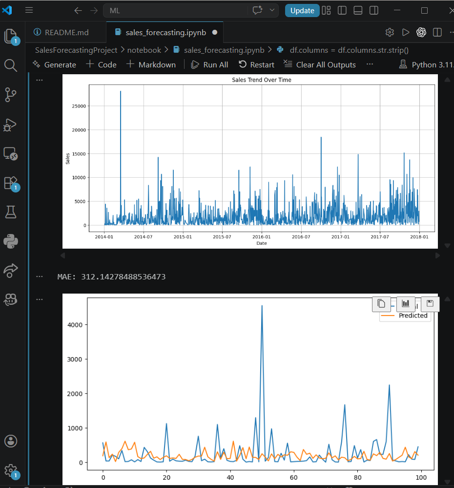

# 📈 Sales Forecasting System Using Machine Learning

## 🚀 Project Overview

This project focuses on predicting future sales using historical retail business data and Machine Learning techniques.

Sales forecasting is one of the most important applications of Machine Learning in real-world businesses. Accurate forecasts help companies:

- Manage inventory efficiently
- Reduce overstocking and losses
- Plan staffing requirements
- Estimate future revenue
- Improve business decision-making

This system analyzes historical sales patterns, creates time-based features, trains a Machine Learning model, and predicts future sales trends.

---

# 🛠️ Technologies Used

| Technology | Purpose |
|---|---|
| Python | Programming Language |
| Pandas | Data Cleaning & Analysis |
| NumPy | Numerical Operations |
| Matplotlib | Data Visualization |
| Scikit-learn | Machine Learning |
| Jupyter Notebook | Development Environment |

---

# 📂 Dataset Used

Dataset: Superstore Sales Dataset

The dataset contains:
- Order details
- Sales information
- Product categories
- Regional data
- Customer information
- Profit and quantity details

---

# ⚙️ Project Workflow

## ✅ 1. Data Preprocessing

- Removed missing values
- Cleaned column names
- Converted date columns into datetime format

```python
df['Order Date'] = pd.to_datetime(df['Order Date'])
```

---

## ✅ 2. Feature Engineering

Created important time-based features:
- Year
- Month
- Day

These features help the model understand:
- trends
- seasonality
- sales patterns over time

```python
df['year'] = df['Order Date'].dt.year
df['month'] = df['Order Date'].dt.month
df['day'] = df['Order Date'].dt.day
```

---

## ✅ 3. Sales Trend Analysis

The project visualizes sales performance over time to identify patterns and demand spikes.

### 📊 Sales Trend Visualization


---

## ✅ 4. Machine Learning Model

The forecasting system uses:

### 🌲 Random Forest Regressor

Why Random Forest?
- Handles complex relationships
- Works well with business datasets
- Improves prediction accuracy
- Captures non-linear patterns

---

## ✅ 5. Model Evaluation

The model performance was evaluated using:

- MAE (Mean Absolute Error)
- RMSE (Root Mean Squared Error)
- R² Score

These metrics help measure prediction quality and forecasting accuracy.

---

# 📉 Actual vs Predicted Sales

The graph below compares actual sales values with predicted sales values generated by the Machine Learning model.


You can see over screenshots folder provided in this repo

---

# 🔮 Future Sales Forecasting

The trained model can predict future sales using upcoming dates.

Businesses can use these forecasts for:
- inventory planning
- staffing preparation
- financial forecasting
- demand management

---

# 💡 Business Insights

From the analysis:

✅ Sales patterns vary across time periods  
✅ Certain periods show higher customer demand  
✅ Forecasting helps businesses reduce inventory waste  
✅ Predictive analytics improves operational planning  
✅ Machine Learning supports data-driven business decisions  

---

# 📌 Key Features

✔ Data Cleaning  
✔ Time-Based Feature Engineering  
✔ Sales Trend Visualization  
✔ Machine Learning Forecasting  
✔ Forecast Evaluation  
✔ Business Insights Generation  

---

# 🔥 Future Improvements

Possible future enhancements:
- Power BI Dashboard
- Tableau Integration
- ARIMA / Prophet Forecasting
- Real-Time Prediction System
- Web Application Deployment

---

# 📷 Project Screenshot



---

# 🎯 Conclusion

This project demonstrates how Machine Learning can be applied to solve real business forecasting problems using historical sales data.

The forecasting system helps businesses make smarter decisions by analyzing trends, predicting future demand, and improving operational planning.

---

# 👩‍💻 Author

**M. Hasini**

Machine Learning & Data Analytics Enthusiast 🚀
